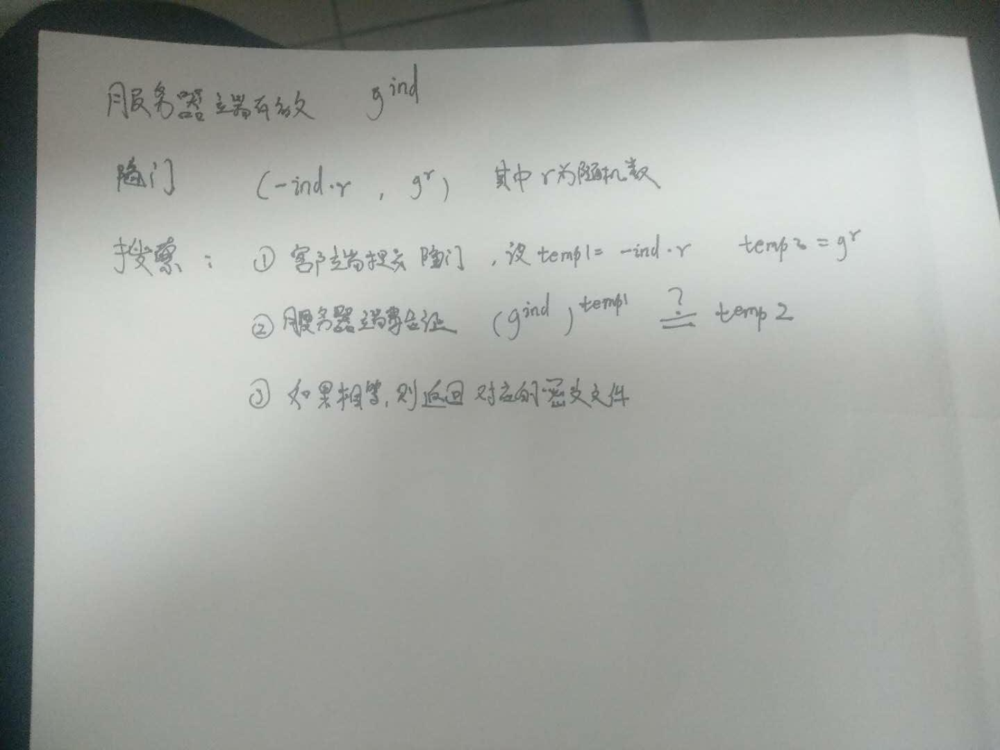
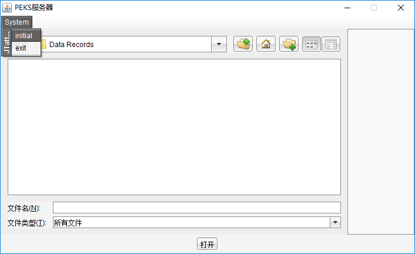
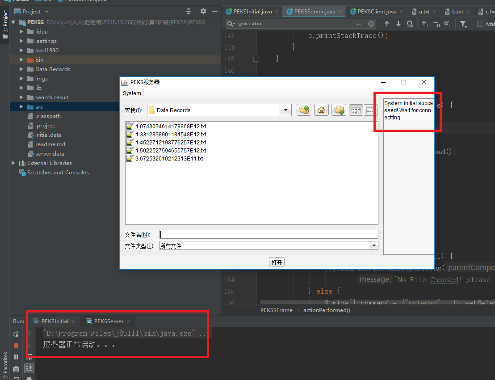
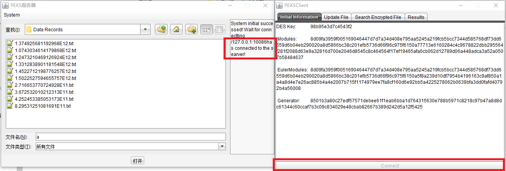
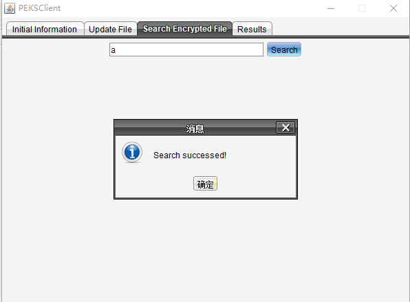
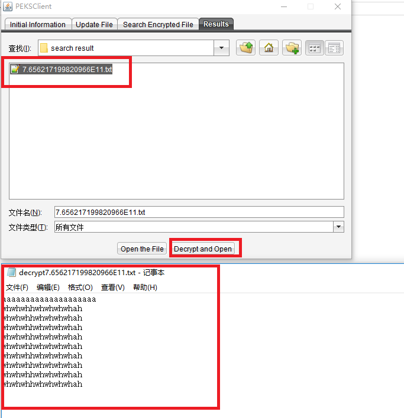

> 运行项目之前需要将lib文件夹下面的JTattoo-1.6.11.jar添加到你的项目依赖中

# 算法原理

# 测试流程

1. 运行PEKSInitial.java生成系统参数

将会在项目根目录下面生成initial.data 和 server.data

> server.data是公开的，而initial.data由客户端保管

2. 运行PEKSServer.java，点击initial

如果正常则在控制台输出“服务器正常启动”，在界面上显示“System initial successed! wait for connection”

3. 运行PEKSServer.java，点击connect

如果连接成功，则在服务器端显示“127.0.0.1：10086 has connected to the server”

4. 进入Search Encrypted File，输入关键词，点击”search“

5. 进入Results，选中搜索结果对应的文件（如果没看见的话需要刷新一下），点击Decrypt and Open

